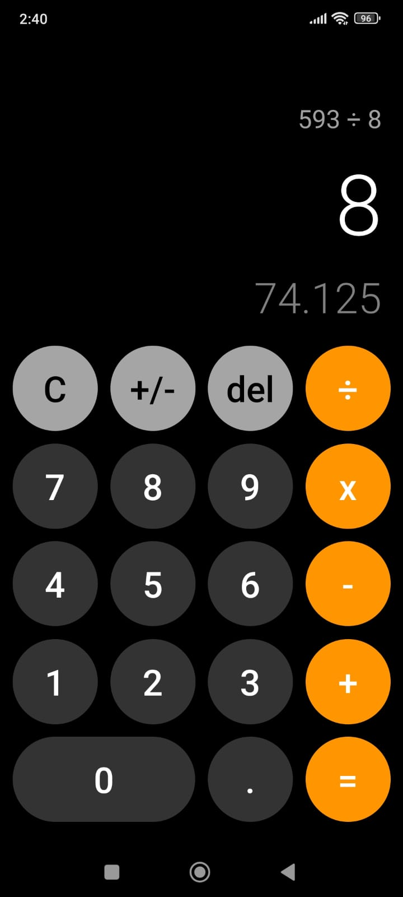

# 🧮 Calculator App

Calculadora estilo iOS construida con React Native y Expo. Incluye operaciones básicas, vista previa de resultados en tiempo real, retroalimentación háptica y más. Basada en el curso de Fernando Herrera.

## 📱 Preview

<p align="center">
  
  
  
</p>

## ✨ Características

- **Operaciones básicas**: Suma, resta, multiplicación y división
- **Vista previa en tiempo real**: Ve el resultado mientras escribes la operación
- **Cambio de signo (+/-)**: Convierte números positivos a negativos y viceversa
- **Soporte decimal**: Trabaja con números decimales
- **Borrar (DEL)**: Elimina el último dígito ingresado
- **Limpiar (C)**: Reinicia la calculadora
- **Límite de dígitos**: Máximo 9 dígitos por número
- **Validación**: Previene división por cero
- **Copiar resultado**: Toca el display para copiar al portapapeles
- **Retroalimentación háptica**: Vibración al presionar botones
- **Formato de números**: Separadores de miles para mejor legibilidad

## 🛠️ Tecnologías

- **React Native** 0.81
- **Expo** 54
- **TypeScript**
- **expo-router** - Navegación basada en archivos
- **expo-haptics** - Retroalimentación háptica
- **expo-clipboard** - Copiar al portapapeles

## 🚀 Instalación

```bash
# Clonar el repositorio
git clone <url-del-repositorio>

# Entrar al directorio
cd calculator-app

# Instalar dependencias
pnpm install

# Iniciar la aplicación
pnpm start
```

Escanea el código QR con Expo Go (Android) o la cámara (iOS) para ver la app en tu dispositivo.

## 📁 Estructura del Proyecto

```
calculator-app/
├── app/
│   ├── _layout.tsx        # Layout principal
│   └── index.tsx          # Pantalla de la calculadora
├── components/calculator/
│   ├── CalculatorButton.tsx
│   ├── CalculatorDisplay.tsx
│   ├── CalculatorKeypad.tsx
│   └── DonationModal.tsx
├── hooks/
│   └── useCalculator.ts   # Lógica de la calculadora
├── constants/
│   └── theme.ts           # Colores y estilos
├── types/
│   └── calculator.ts      # Tipos TypeScript
└── public/img/            # Screenshots
```

## 📄 Licencia

MIT
